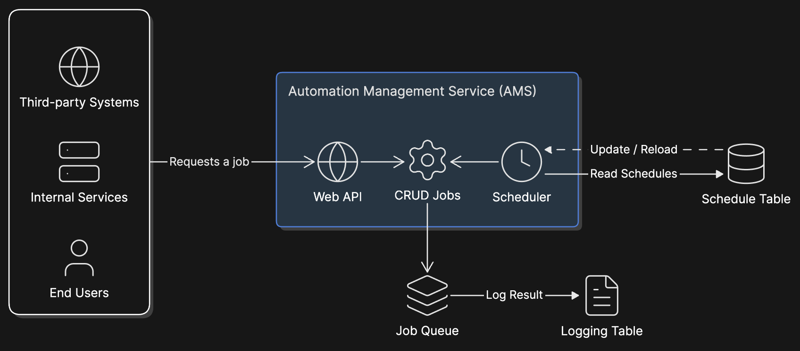

# ams

The automation manager service coordinates adding jobs to a job queue via 2 primary sources, a schedule and an api interface.

The diagram below demonstrates how the system works to create jobs from external requests and the scheduler.

## The Manager, Scheduler, and Queue processes

The Manager, Scheduler, and the Queue make up the core of how the automation management service delegates jobs to workers. At a high level, the schedule and manager services both add jobs into the queue table, and the queue table is used by the worker service to check what job to work next.

The Scheduler adds jobs to the queue when they're due based on the job's schedule, and secondarily if and when jobs schedules are changed. for example, when a job's schedule is disabled, the scheduler should attempt to remove the job from the queue if it has already been added.

The Manager adds jobs to the queue primarily when triggered by events, such as an endpoint or webhook event (these will be added in the future).

The Queue service primarily consists of a fifo table. The job's status value controls whether or not an item can be dequeued by a worker, this allows dependencies to be controlled and dequeued if a dependency fails.

### Job Queue

The job queue is the central pillar that delegates and manages jobs.

#### Core Ideas

- The queue generates correlation IDs when a job with no upstream dependencies (depends_on is null) has a `"ready"` state. This is passed to any system or automation downstream that should keep track of the automation, primarily the logger and worker or any dependent autoamtions.
